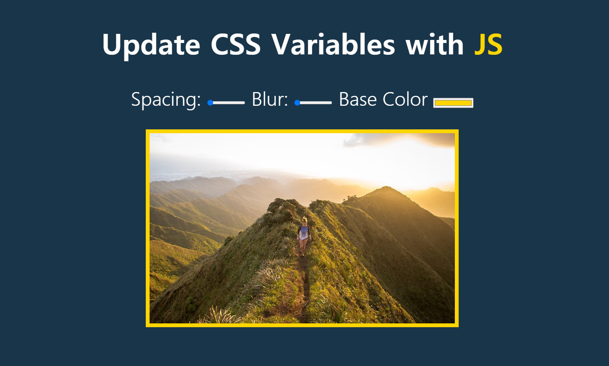

# 3. CSS Variables

## 1) :root

`:root`

- `html`선택자 보다 명시도가 더 낮은 점 빼고는 문서 트리의 루트 요소를 선택하기 때문에 다른 특징은 `html`선택자와 동일함

  [출처](https://developer.mozilla.org/ko/docs/Web/CSS/:root)

  - 명시도(specificity)

    : 주어진 CSS 선언에 적용되는 가중치(weight)

    [출처](https://developer.mozilla.org/ko/docs/Web/CSS/Specificity)


- 전역 CSS변수 선언할 때 유용하게 사용됨

  ```css
  :root {
      --main-bg-color: #ffffff;
      --pane-padding: 5px 42px;
  }
  ```

- 변수 사용하는 방법

  ```css
  .one {
      background-color: var(--main-bg-color);
  }
  ```

  

## 2) dataset

태그에 `data-{이름}`속성을 만들면 js에서 `dataset.이름`으로 불러와서 사용할 수 있다.

- 예시

  ```html
  <body>
      <div class="controls">
      	<label for="blur">Blur</label>
      	<input id="blur" type="range" name="blur" min="0" max="25" value="10" data-sizing="px">    
      </div>
      
  </body>
  
  <script>
  	const inputs = document.querySelectorAll('.controls input')
      
      function handleUpdate() {
          const suffix = this.dataset.sizing || '';
          document.documentElement.style.setProperty(`--${this.name}`, this.value + suffix);
      }
      
      inputs.forEach(input => input.addEventListener('change', handleUpdate));
      inputs.forEach(input => input.addEventListener('mousemove', handleUpdate));
  </script>
  ```


