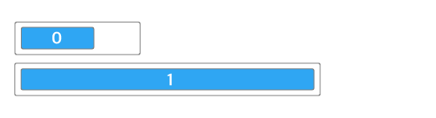
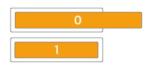
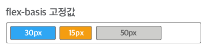
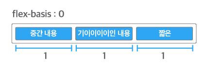
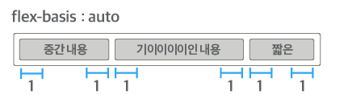

# 1. flex: 1

- `flex-grow`속성과 `flex-shrink`속성, `flex-basis`속성을 축약해서 `flex`속성으로 표현할 때 `flex: 1`속성은 `flex: 1 1 0`속성을 의미함

## 1) flex-grow

> flex item의 확장에 관련된 속성

- 0과 양의 정수를 속성 값에 사용함
- 속성 값이 0인 경우
  -  felx contatiner의 크기가 커져도 flex item의 크기가 커지지 않고 원래 크기로 유지됨
- 속성 값이 1 이상인 경우
  - flex item의 원래 크기에 상관없이 flex container를 채우도록 flex item의 크기가 커짐
- flex container의 크기가 커질 때 flex item의 크기도 커지게 하려면 1 이상의 값을 속성값으로 설정함

## 2) flex-shrink

> flex item의 축소에 관련된 속성

- 0과 양의 정수를 속성 값에 사용
- 기본 값은 1
- 속성 값이 0인 경우
  - flex container의 크기가 flex item의 크기보다 작아져도 flex item의 크기가 줄어들지 않고 원래 크기로 유지됨
- 속성 값이 1 이상인 경우
  - flex container의 크기가 flex item의 크기보다 작아질 때 flex item의 크기가 flex container의 크기에 맞추어 줄어듦

## 3) flex-basis

> flex item의 기본 크기를 결정하는 속성

- 기본 값은 auto

- width 속성에서 사용하는 모든 단위(px, %, em, rem 등)를 속성 값에 사용할 수 있음

- flex-basis 속성의 값을 30px이나 30%와 같이 설정하면 flex item의 크기가 고정됨

  

- flex-basis 속성에서 자주 사용하는 속성 값

  - auto
  - 0

- flex-basis 속성 값이 0인 경우

  - flex item은 절대적 flex item(absolute flex item)이 되어 flex container를 기준으로 크기가 결정됨
  - **주의**
    - flex-basis 속성 값이 0인 경우 `flex-basis: 0px`, `flex-basis: 0%`와 같이 단위도 함께 설정해야 함

  

- flex-basis 속성 값이 auto인 경우

  - flex item은 상대적 flex item(relative flex item)이 되어 콘텐츠의 크기를 기준으로 크기가 결정됨

  