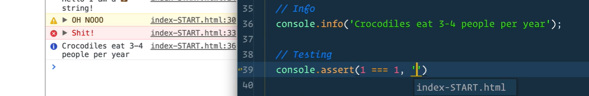
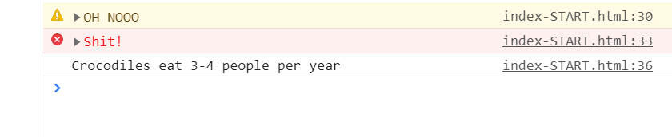
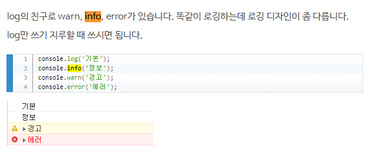
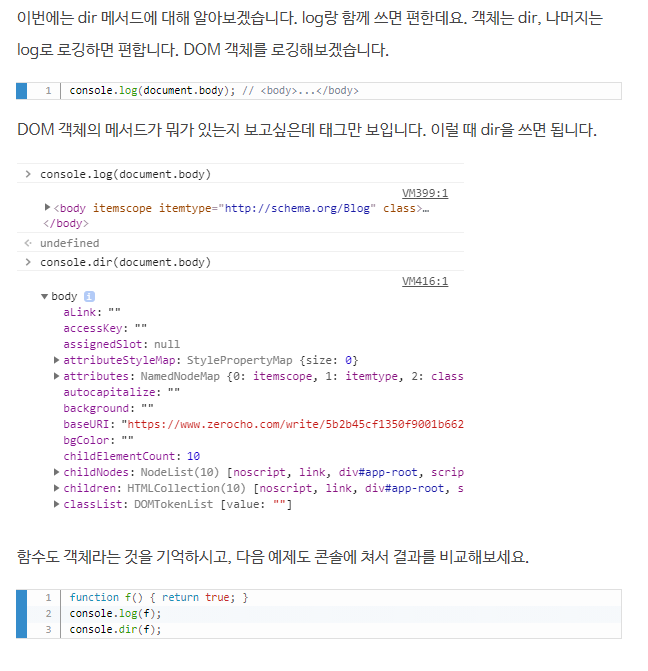

# 1. console.info

강의에서는 이렇게 앞에 느낌표가 붙었는데, 

내가 하면 이렇게 안 붙길래 찾아봄

> 

원래 이렇게 안붙나보다 ..

근데 이 글 보면서 좋은 기능을 배웠다. -> `dir`

# 2. `dir`

> DOM 객체의 메서드가 뭐가 있는지 보여줌

항상 document를 log찍어서 메서드 확인했는데, 이제 dir로 메서드를 확인할 수 있겠다 8ㅅ8

출처 : https://www.zerocho.com/category/JavaScript/post/5b2b45cf1350f9001b662ba6

# 3. `axios` VS `fetch`

나는 `axios`만 배웠는데, 챌린지에서는 `fetch`를 사용하길래 둘을 비교해봄

## 1) 공통점

- Ajax (Asynchronous Javascript And Xml)
  - JavaScript를 사용한 비동기 통신
  - 클라이언트와 서버간의 XML 데이터를 주고받는 기술
  - XMLHttpRequest객체를 이용해서 전체 페이지를 reload하지 않고 필요한 데이터만 로드할 수 있음

## 2) 각각의 특징

### (1) `axios`

- 구형 브라우저를 지원함
- 응답 시간 초과를 설정하는 방법이 있음
- JSON 데이터 자동 변환이 가능
- node.js에서의 사용이 가능함
- request aborting(요청 취소)가 가능함
- catch에 걸렸을 때, `.then`을 실행하지 않고, console창에 해당 에러 로그를 보여줌
- return값은 Promise 객체 형태

### (2) fetch

- JavaScript의 내장 라이브러리이기 때문에 import 하지 않고 사용할 수 있음

- 라이브러리의 업데이트에 따른 에러 방지가 가능함

  (React Native의 경우 업데이트가 잦아서 라이브러리가 쫓아오지 못하는 경우가 많은데, fetch의 경우 이를 방지할 수 있음)

- 네트워크 에러가 발생했을 때 기다려야함 (response timeout API 제공 X)
- 지원하지 않는 브라우저가 있음
- return값은 Promise 객체 형태

출처 : https://velog.io/@leeeeunz/TIL-35.-axios%EC%99%80-fetch%EC%9D%98-%EC%B0%A8%EC%9D%B4%EC%A0%90

출처 : https://hoorooroob.tistory.com/entry/React-React-Naive-TIPS-axios-%EC%99%80-fetch-%EC%96%B4%EB%96%A4-%EA%B2%83%EC%9D%84-%EC%82%AC%EC%9A%A9%ED%95%A0%EA%B9%8C